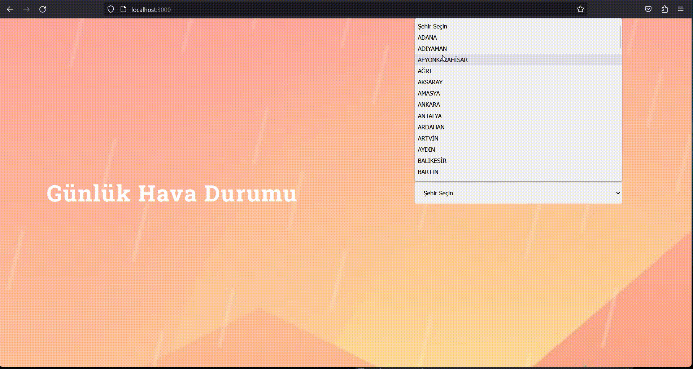

# ReactJs-WeatherApp

 
 
 
 
 
 

## About this project
* A simple application that selects the city I made with React and pulls the current weather information

 

 ---

 

## Found in this project 🚀

- **✅ Fetch**

 

 ---

 
 

[**Live Demo 🌎**]()

